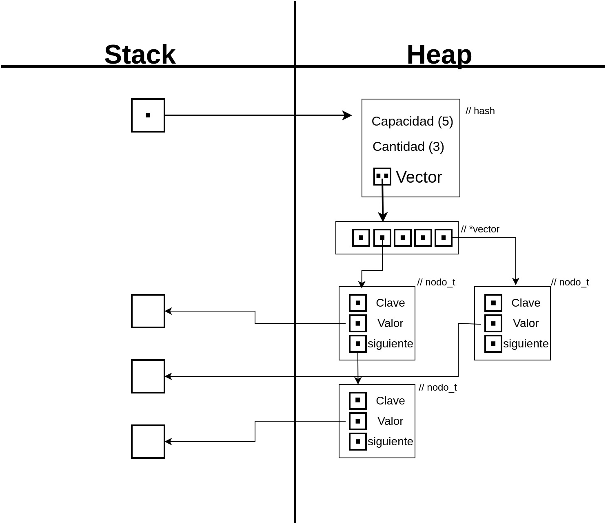
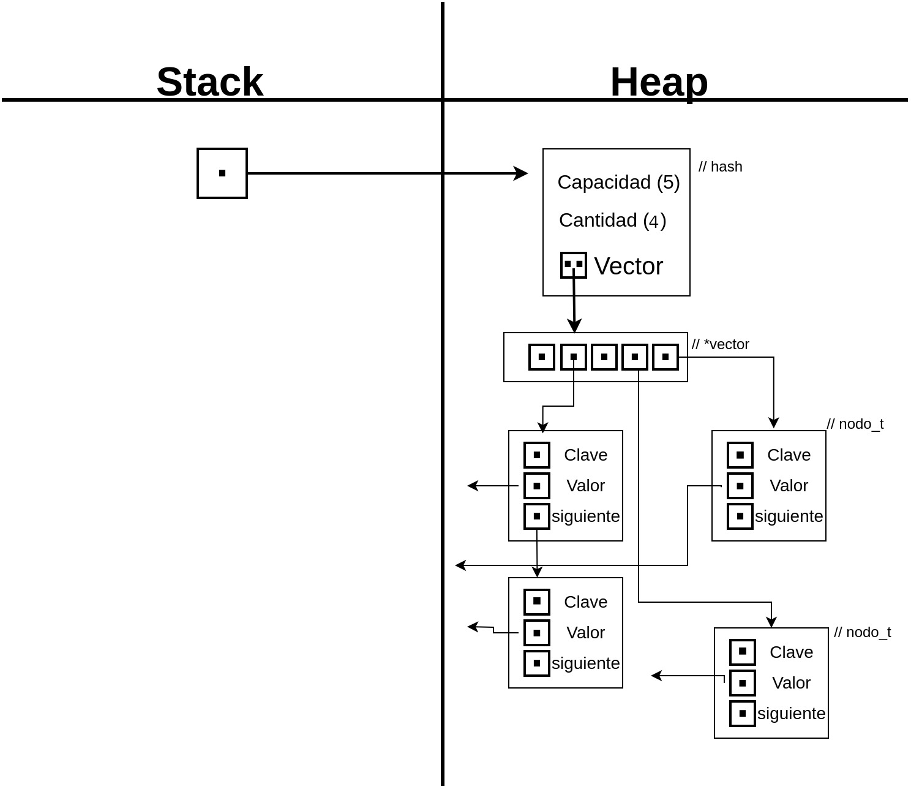
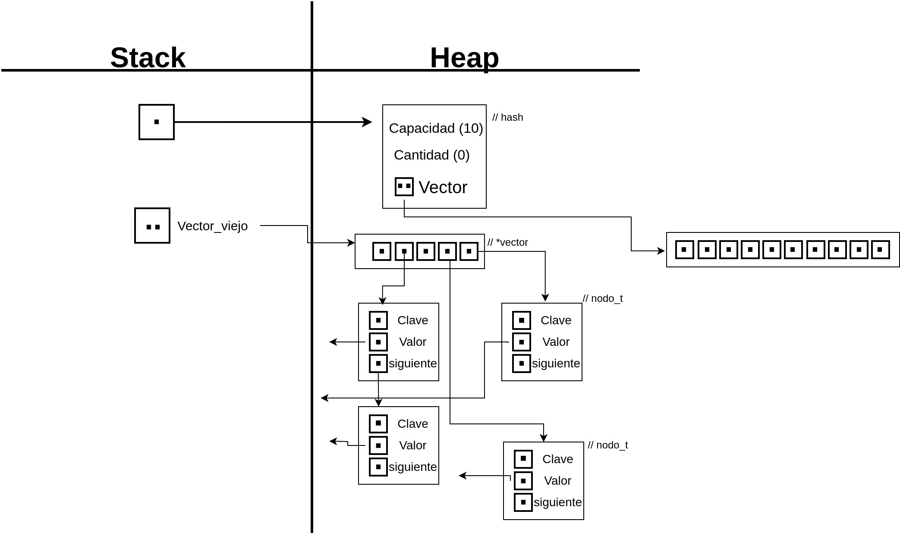
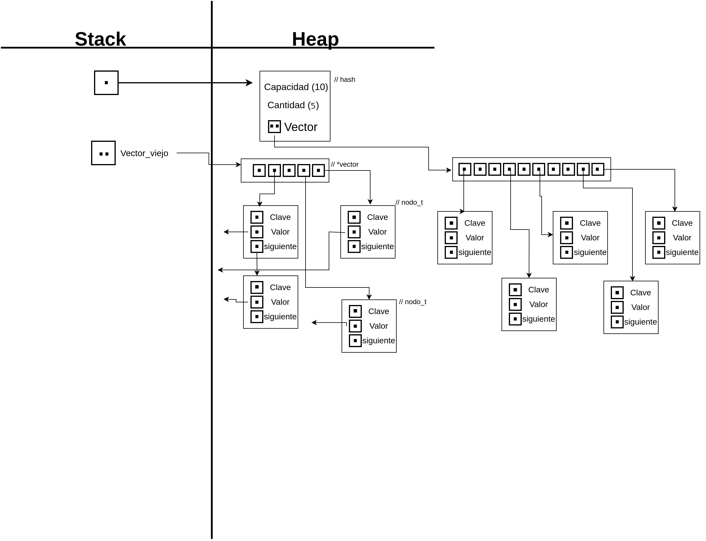
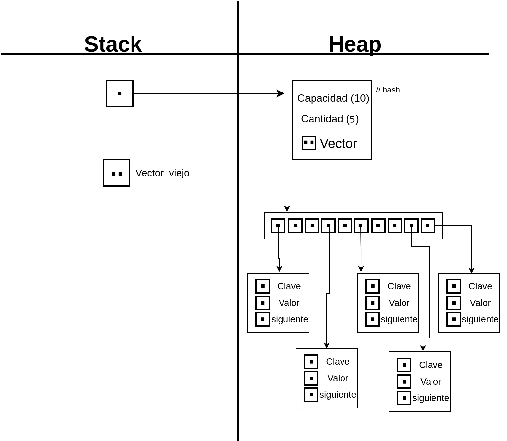

# TDA HASH

## Repositorio de Sebastian Furnier - (110129) - (sfurnier@fi.uba.ar)

- Para compilar:

```bash
make compilar
```

- Para ejecutar:

```bash
make correr
```

- Para ejecutar con valgrind:
```bash
make correr-valgrind
```
---
##  Funcionamiento

Para este TDA implemente 2 estructuras, una para alojar lo pares clave-valor. Estos datos los guardo en estructuras llamadas nodos, donde tambien se guarda un puntero de tipo nodo, que nos servira para encadenar en caso de coliciones.
La otra estructura es la del diccionario, donde guardamos la capacidad de pares que pueden alojarse, la cantidad alojada y un vector de punteros nodo.

### Implementacion:

El programa define las operaciones basicas para la creacion de un diccionario y el guardado de datos dentro de el. Luego se implementaron funciones auxiliares, por ejemplo:    Para mantener la complejidad de las operaciones de insercion, busqueda, eliminacion, etc. implemente una funcion de rehash. Esta funcion recibe el diccionario y crea un vector de punteros nuevo del doble de tamaño del actual usado por el diccionario. Luego reinserto todos los pares clave-valor y elimino el vector viejo junto con sus nodos y claves.

A continuacion adjunto diagramas de un hash abierto de direccionamiento cerrado de capacidad 5 y cantidad de pares insertados 3. En este hash las coliciones (nodos cuyas claves comparten el mismo hash) se encadenan en la misma posicion del vector.

<div align="center">

</div>

Y a continuacion al añadir un par clave-valor nuevo mostramos la logica del rehash implementada.

Insertamos un cuarto nodo.

<div align="center">

</div>

Tomamos un parametro que nos permita saber cuando incrementar la capacidad del hash,  lo llamamos factor de carga maximo y le asignamos un valor arbitrario, en este caso 0.7.
Este factor de carga se verifica en la funcion hash_insertar de la siguiente manera: cantidad/capacidad (ambos datos guardados en la estructura del hash).

En el caso graficado al querer insertar un quinto vector el factor de carga nos da 4/5 = 0.8.

Se llama entonces a la funcion rehash, guardamos en un nuevo puntero la direccion del vector a reemplazar y se crea un vector nuevo del doble de capacidad.

<div align="center">

</div>

Recorro el vector antiguo y reinserto los pares claves-valor en el nuevo nodo.

<div align="center">

</div>

Luego elimino cada nodo del vector anterior y libero la memoria asignada a dicho vector.

<div align="center">

</div>

---

## Respuestas a las preguntas teóricas

### - Qué es un diccionario.
    Un diccionario es una estructura de datos que guarda pares de elementos clave-valor. Dicha clave es unica para cada valor asociado y se usa como indice.

### - Qué es una función de hash y qué características debe tener.
    Es una funcion que recibe una clave (puede ser de cualquier tipo), y devuelve un valor numerico. Estos valores devueltos son unicos para cada clave.
    
    Resistencia a colisiones: Una funcion de hash debe tener la capacidad de generar pocas coliciones (una colision se produce cuando para 2 o mas claves distintas, la funcion produce un mismo valor de retorno.).
### - Qué es una tabla de Hash y los diferentes métodos de resolución de colisiones vistos (encadenamiento, probing, zona de desborde).
    Una tabla de hash es un tipo de implementacion de un diccionario. Se usa una funcion de hash para obtener un numero unico para cada clave el cual servira como indice para acceder a las posiciones de la tabla donde estaran almacenados los pares clave-valor. En este TP, la tabla de hash se implemento como un vector de punteros a estructuras nodos.

    La forma de solucionar las coliciones determinan si un hash es abierto o cerrado. Uno abierto tiene direccionamiento cerrado, esto quiere decir que las coliciones se guardan todas en el mismo indice, pero se "encadenan", saliendo por fuera de la tabla de hash.

    Uno cerrado con direccionamiento abierto, los elementos quedan todos dentro de la tabla de hash pero en posiciones que no son las devueltas por la funcion de hash.

    Probing: 
    Cuando se produce una colicion, se busca la primer posicion libre y se guarda ahi el par insertado, esto se llama probing lineal (hay otros tipos de soluciones como probing cuadratico).

    Zona de desborde:
    La idea es tener una estructura que almacene solo los pares cuyo hash coliciono en el diccionario. Puede implementarse de distintas maneras, como una lista, arbol o reservando posiciones en la misma tabla de hash.
